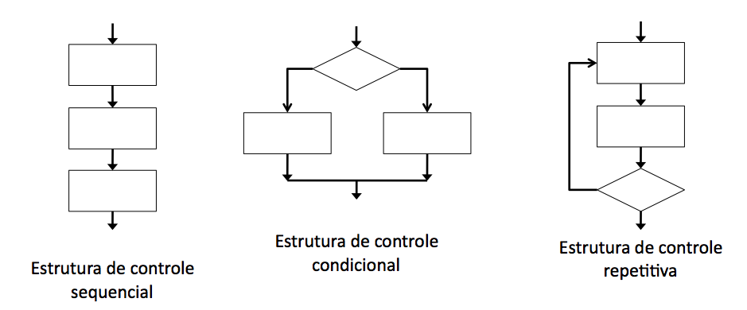

&nbsp;
<center>
  
  # Introdução à Programação de Computadores para Biologia
  # Algoritmos e Introdução ao Perl

</center>

&nbsp;
&nbsp;
&nbsp;
&nbsp;

##### Aula 03

###### [https://tttorres.github.io/introprog/](https://tttorres.github.io/introprog/)


---

# ALGORITMOS
## O que são?

> "Uma série de instruções para a resolução de um problema"

&nbsp;
&nbsp;
&nbsp;

---

# ALGORITMOS
## O que são?

> "Uma série de instruções para a resolução de um problema"

- Exemplo I:
	- Problema: acordar de manhã.

&nbsp;


---

# ALGORITMOS
## O que são?

> "Uma série de instruções para a resolução de um problema"

- Exemplo I:
	- Problema: acordar de manhã.
	- Solução: descrição dos passos necessários para essa árdua tarefa!


---


# ALGORITMOS
## EXEMPLO I: Algoritmo matinal

<small><small>
```
1. Acordar;
2. Se o despertador não tocou,
	2.1) voltar a dormir;
3. Se o despertador tocou,
	3.1) apertar o botão soneca;
4. Repetir o passo 3 por "n" vezes;
5. Levantar e caminhar até o banheiro;
6. Escovar os dentes;
7. Ligar a cafeteira;
8. Se não houver uma xícara limpa;
	8.1) ir ao passo 19;
9. Se houver uma xícara limpa,
	8.2) Colocar água na xícara;
10. Adicionar a água na cafeteira;
11. Repetir os passos 9 e 10 até que o nível na cafeteira seja = a "l"
12. Pegar o café ou capsula de café;
13. Adicionar o café a cafeteira;
14. Repetir o passo 13 por “m” vezes, se não é uma cafeteira de cápsula;
15. Colocar a xícara embaixo da saída do café; 
16. Apertar o botão com o desenho da xícara;
17. Esperar 1 min até a saída completa do café;
18. Saborear o café;
19. Desligar a cafeteira;
21. Repetir a função 6;
22. Sair;
```

</small></small>


---

# ALGORITMOS
## O que são?

> "Uma receita para a resolução de um problema"


&nbsp;
&nbsp;
&nbsp;
&nbsp;


---


# ALGORITMOS
## O que são?

> "Uma receita para a resolução de um problema"

- Exemplo II:

	- Problema: preparar um bolo de cenoura
	- Solução: descrição da receita


---


# ALGORITMOS
## EXEMPLO II: Bolo de Cenoura


 
```perl
1. Separar os seguintes ingredientes:
	1.1) 3cenouras médias raladas; 
	1.2) 4 ovos;
	1.3) 1/2 xícara (chá) de óleo;
	1.4) 2 xícaras (chá) de açúcar;
	1.5) 2 1/2 xícaras (chá) de farinha de trigo;
	1.6) 1 colher (sopa) de fermento em pó;
2. Ligar o forno para pré aquecimento a 180oC;
3. Bater no liquidificador as cenouras, os ovos e o óleo;
4. Transferir o resultado para uma vasilha;
5. Juntar aos poucos a farinha e o açúcar;
6. Misturar bem; 
7. Misturar o fermento suavemente com uma colher;
8. Se temperatura do forno estiver a 180oC: 
	8.1) Coloque o bolo no forno; 
9. Senão, esperar até atingir 180oC e repetir o passo 8;
10. Assar o bolo até que, ao espetar com um palito, o palito fique limpo;
11. Tirar do forno; 
12. O bolo está pronto. 
```


---


# ALGORITMOS
## EXEMPLO II: Bolo de Cenoura

<span style="font-size:70%">
  
- Objetos de consumo (entrada):
	- cenouras
	- ovos
	- farinha
	- óleo
	- açucar
	- fermento

- Objetos de apoio (atores, executores):
	- vasilha
	- liquidificador
	- xícara
	- colher de sopa
	- fogão
	- palito
	- cozinheiro(a)

</span>

---


# ALGORITMOS
## EXEMPLO II: Bolo de Cenoura

&nbsp;
&nbsp;


  
- Objeto produzido (saída):
	- bolo


- Objeto que descreve o processo(receita):
	- Algoritmo


---


# ALGORITMOS
## Características


1. É formado por um texto finito;
	- receita dada.
2. É composto por instruções elementares;
	- elementar depende do contexto.
3. É uma receita metódica, passo-a-passo;
	- passo inicial;
	- passo(s) intermediário(s);
	- passo final.
4. Ao executar: 
	- partindo de dados válidos, deve sempre terminar;
	- partindo de dados inválidos, pode produzir lixo, ou mesmo não terminar. 


---

# ALGORITMOS
## Características


> O enfoque deste curso está nos algoritmos computacionais, ou seja, algoritmos que “descrevem uma sequência de ações que podem ser traduzidas para alguma linguagem de programação” 


---


# ALGORITMOS
## Representações
<span style="font-size:80%">
  
1. Linguagem escrita (português);
	- exemplos I e II.
2. Fluxogramas;
	- representação gráfica.

</span>




---
<center>

## Representações: bolo de cenoura


</center>

---


# ALGORITMOS
## Representações
<span style="font-size:80%">
  
1. Linguagem escrita (português);
	- exemplos I e II.
2. Fluxogramas;
	- representação gráfica.


<span style="color:red">3. Linguagens de programação </span>
	
    
</span>

---

# PERL
## ‘‘Practical Extraction and Reporting Language’’ 


---


# PERL
## ‘‘Practical Extraction and Reporting Language’’ 

> Pathologically Eclectic Rubbish Lister
>                           **Larry Wall**

&nbsp;


- Linguagem interpretada;
- muito utilizada em bioinformática; 
- menos regras e múltiplas formas de resolver um problema.


---


# PERL
## ‘‘Practical Extraction and Reporting Language’’ 

> Pathologically Eclectic Rubbish Lister
>                           **Larry Wall**

&nbsp;


- Linguagem interpretada;
- muito utilizada em bioinformática; 
- menos regras e múltiplas formas de resolver um problema.

&nbsp;

<center> 

### ‘‘For programmers, laziness is a virtue.’’

</center>


---


# PERL
## ‘‘Practical Extraction and Reporting Language’’ 

> Aaaain, mas por que não aprendemos Python?
>                                   **Aluno**

&nbsp;


- muito utilizada em bioinformática; 
- menos regras e múltiplas formas de resolver um problema;

<span style="color:red">

- expressões regulares 

</span>


---

# PERL
## Geany IDE 

&nbsp;

1. Verificar a instalação do Geany.
2. Se não estiver instalado, fazer o download em: [geany.org](geany.org)

&nbsp;


---


# PERL
## Primeiro Programa 

&nbsp;

1. No Geany, File > New.

2. File > Save as...

3. Criar a pasta "introprog" no diretório home/aluno.

4. Gravar arquivo como "hello.pl"

&nbsp;

---

# PERL
## Primeiro Programa 

&nbsp;

5. No arquivo criado escreva: 

```perl
print "Hello world!\n";
```
6. File > Save (ou ctrl+S)

7. No terminal escreva:

```bash
perl ~/home/aluno/hello.pl 
```

 :+1: :clap: :tada:

---

# PERL
## Primeiro Programa 

&nbsp;

8. No arquivo hello.pl escreva: 

```perl
# Uhu! Meu primeiro script!
print "Hello world!\n";
```
9. File > Save (ou ctrl+S)

10. No terminal escreva:

```bash
perl ~/home/aluno/hello.pl 
```

 :scream: 

---


# PERL
## Primeiro Programa 


No arquivo hello.pl escreva: 

```perl
#! /usr/bin/perl 

# Uhu! Meu primeiro script!
print "Hello world!\n";
```

No terminal (pasta ```home/aluno``` ) escreva:
```bash
ls -la
```
```bash
chmod 777 hello.pl
```
```bash
ls -la
```
```bash
./hello.pl
```


---


---

