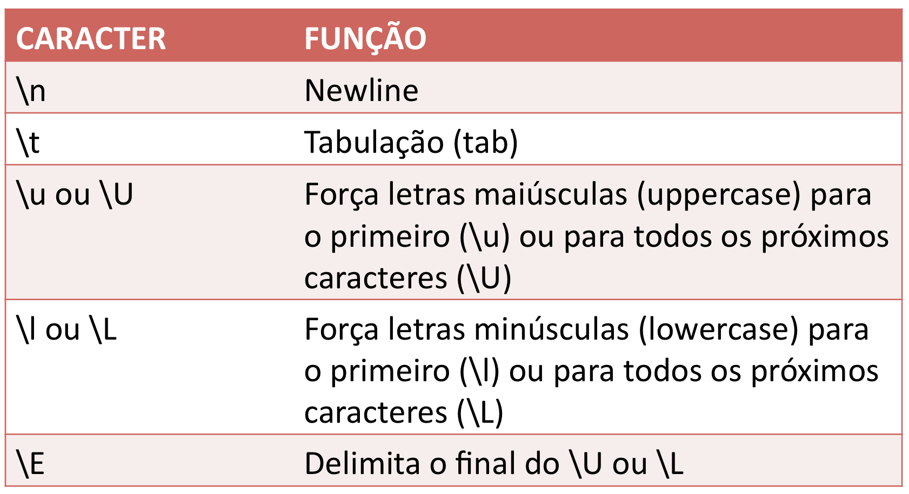
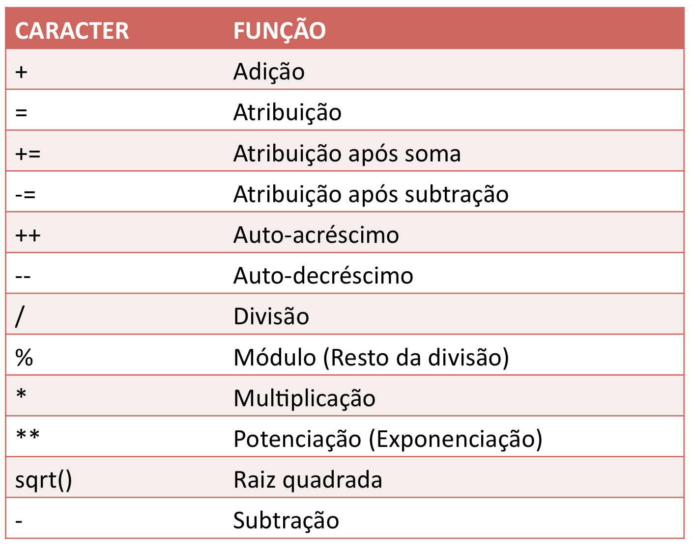

&nbsp;
  
# Introdução à Programação de Computadores para Biologia  
# Tipos de dados  

&nbsp;
&nbsp;
&nbsp;
&nbsp;

##### Aula 03

###### [https://tttorres.github.io/introprog/](https://tttorres.github.io/introprog/)


---


# PERL
## Primeiro Programa 


Arquivo hello.pl: 

```perl
#! /usr/bin/perl 

# Uhu! Meu primeiro script!
print "Hello world!\n";
```

No terminal:
```bash
$ perl hello.pl
Hello world!
$
```


---


# PERL
## Primeiro Programa 


Arquivo hello.pl: 

```perl
#! /usr/bin/perl 

# Uhu! Meu primeiro script!
print "Hello world!\n";
```

No terminal:
```bash
$ perl hello.pl Sao Paulo
Hello Sao Paulo!
$
```


---


# TIPOS DE DADOS
## Variáveis 


1. Escalares ($):
  
```perl
my $variavel_escalar = 1; 
my $cidade = "Sao Paulo";
my $sequencia = "ATCCTACTGTGCGTCAGGCTAAGCTA";  
```
  
2. Arrays, vetores (@):  

```

```  
  
3. Hashes, vetores associativos (%):  

```

```  
  
---

# VARIÁVEIS ESCALARES
## Variáveis 


1. Nomes precedidos de "$":

```perl
my $cidade = "Sao Paulo";      #correto 
my $ cidade = "Sao Paulo";     #incorreto 
```  
  
2.  
```perl


```
---
# VARIÁVEIS ESCALARES
## Variáveis 

<span style="font-size:80%">
  
1. Nomes precedidos de "$":

```perl
my $cidade = "Sao Paulo";      #correto 
my $ cidade = "Sao Paulo";     #incorreto 
```

2. Nomes podem conter uma ou mais letras "A-Z" ou "a-z" incluindo "_" e depois dela(s) números:
```perl
my $v = 1;          #correto
my $var = 1;        #correto
my $var1 = 1;       #correto
my $var2 = 2;       #correto
my $var_1 = 1;      #correto
my $var 1 = 1;      #incorreto
my $1var = 1;       #incorreto
my $2var = 2;       #incorreto
my $variavel_escalar_criada_para_armazenar_um_numero_real = 1; 
```
</span>

---

# VARIÁVEIS ESCALARES
## Variáveis 

<span style="font-size:80%">
  
3. Variáveis pré-definidas:

```perl
$_
$1
$2
$^
$/
$\
$,
```

4. 

```perl


```
</span>

---

# VARIÁVEIS ESCALARES
## Variáveis 

<span style="font-size:80%">
  
3. Variáveis pré-definidas:

```perl
$_
$1
$2
$^
$/
$\
$,
```

4. Perl diferencia maiúsculas e minúsculas.

```perl
my $VAR = 1;
my $VAr = 2;
my $Var = 3;
my $var = 4;
```
</span>

---

# VARIÁVEIS ESCALARES
## Atribuição 

**Operador de atribuição, "="**
  
```perl
$var = 1; #atribuindo 1 a variavel $var


```
---

# VARIÁVEIS ESCALARES
## Atribuição 

**Operador de atribuição, "="**
  
```perl
$var = 1; #atribuindo 1 a variavel $var

1 = $var; 


```

---

# VARIÁVEIS ESCALARES
## Atribuição 

**Operador de atribuição, "="**
  
```perl
$var = 1;    #atribuindo 1 a variavel $var

1 = $var;    #incorreto


```
---

# VARIÁVEIS ESCALARES
## Atribuição 

**Operador de atribuição, "="**
  
```perl
$var = 1;    #atribuindo 1 a variavel $var

1 = $var;    #incorreto

$greetings = "Hello world!";


```

---

# VARIÁVEIS ESCALARES
## Atribuição 

**Operador de atribuição, "="**
  
```perl
$var = 1;    #atribuindo 1 a variavel $var

1 = $var;    #incorreto

$greetings = "Hello world!";

$location = <STDIN>;


```
---

# VARIÁVEIS ESCALARES
## hello.pl


1. Abrir o Geany, arquivo hello.pl.

3. Copiar #exemplo01 da página da disciplina.

4. No terminal:

```bash
perl ~/home/aluno/hello.pl 
```

&nbsp;

---


# VARIÁVEIS ESCALARES
## Impressão


Comando *print*
```perl
#! /usr/bin/perl 

# Meu primeiro script
print "Hello world!\n";


```


---


# VARIÁVEIS ESCALARES
## Impressão


Comando *print*
```perl
#! /usr/bin/perl 

# Meu primeiro script
print "Hello world!\n";

# Imprimir diretamente o conteudo da variavel
$greetings = "Hello world!";
print $greetings;


```
No terminal:

```bash
perl ~/home/aluno/hello.pl 
```
---

# VARIÁVEIS ESCALARES
## Impressão


Comando *print*
```perl
#! /usr/bin/perl 

# Meu primeiro script
print "Hello world!\n";

#exemplo02 - COPIAR DA PAGINA
# Imprimir o conteudo da variavel como parte de uma 
# sentença maior


```


---


# VARIÁVEIS ESCALARES
## Impressão


Comando *print*
```perl
#! /usr/bin/perl 

# Meu primeiro script
print "Hello world!\n";

#exemplo02
# Imprimir o conteudo da variavel como parte de uma 
# sentença maior

print "Eu não suporto mais esse exemplo do $greetings\n";

exit;


```


---

# VARIÁVEIS ESCALARES
## Na prática


1. No Geany, File > New File.

2. Copiar #exemplo01 da página da disciplina.

3. File > Save as...

4. Gravar arquivo como interpolacao.pl


&nbsp;

---


# VARIÁVEIS ESCALARES
## Na prática

&nbsp;
Script: interpolacao.pl
```perl
#! /usr/bin/perl 
# script para testar interpolacao

# declarando minha variavel constante
my $greetings = "Hello world!";

# imprimindo
print "$greetings, mais uma vez!\n";


exit;


```
---

# VARIÁVEIS ESCALARES
## Na prática

&nbsp;
Script: interpolacao.pl
```perl
#! /usr/bin/perl 
# script para testar interpolacao

# declarando minha variavel constante
my $greetings = "Hello world!";

# imprimindo
print "$greetings, mais uma vez!\n";
print "$greetings, mais uma vez!\n";

exit;


```

---

# VARIÁVEIS ESCALARES
## Na prática


Script: interpolacao.pl
Copiar exemplo04 da página da disciplina
```perl
# exemplo04

#! /usr/bin/perl 
# script para testar interpolacao

# declarando minha variavel constante

my $greetings = "Hello world!";

# imprimindo
print 'O nome da nossa variavel eh $greetings';
print " e o conteudo dela eh $greetings.\n";

exit;
```

---

# VARIÁVEIS ESCALARES
## Na prática


Script: interpolacao.pl
E como imprimir "Hello world!" (**COM as aspas**)?
```perl


 


```

---

# VARIÁVEIS ESCALARES
## Na prática


Script: interpolacao.pl
E como imprimir "Hello world!" (**COM as aspas**)?
```perl
# exemplo04

#! /usr/bin/perl 
# script para testar interpolacao

# declarando minha variavel constante

my $greetings = "Hello world!";

# imprimindo
print 'O nome da nossa variavel eh $greetings';
print " e o conteudo dela eh "$greetings".\n";

exit;
```
---

# VARIÁVEIS ESCALARES
## Na prática


Script: interpolacao.pl
E como imprimir "Hello world!" (**COM as aspas**)?
Escapando da interpolação:
```perl
# exemplo04

#! /usr/bin/perl 
# script para testar interpolacao

# declarando minha variavel constante

my $greetings = "Hello world!";

# imprimindo
print 'O nome da nossa variavel eh $greetings';
print " e o conteudo dela eh \"$greetings\".\n";

exit;
```

---

# VARIÁVEIS ESCALARES
## Na prática


Script: interpolacao.pl
Copiar exemplo05 na página da disciplina
Escapando da interpolação:

<span style="font-size:80%">

```perl
# exemplo04

#! /usr/bin/perl 
# script para testar interpolacao

# declarando minha variavel constante

my $greetings = "Hello world!";

# imprimindo
print 'O nome da nossa variavel eh $greetings';
print " e o conteudo dela eh \"$greetings\".\n";

# exemplo05
print "Ah, se eu ganhasse R$1,00 a cada vez que \"$greetings\" fosse usado...\n";

exit;
```

</span>

---

# VARIÁVEIS ESCALARES
## Na prática


Script: interpolacao.pl
Copiar exemplo05 na página da disciplina
Escapando da interpolação:

<span style="font-size:80%">

```perl
# exemplo04

#! /usr/bin/perl 
# script para testar interpolacao

# declarando minha variavel constante

my $greetings = "Hello world!";

# imprimindo
print 'O nome da nossa variavel eh $greetings';
print " e o conteudo dela eh \"$greetings\".\n";

# exemplo05
print "Ah, se eu ganhasse R\$1,00 a cada vez que \"$greetings\" fosse usado...\n";

exit;
```

</span>

---

# VARIÁVEIS ESCALARES
## Na prática


1. No Geany, File > New File.

2. Copiar #exemplo06 da página da disciplina.

3. File > Save as...

4. Gravar arquivo como tabela.pl


&nbsp;

---


# VARIÁVEIS ESCALARES
## Na prática


Script: tabela.pl
Exemplo 06:
```perl
#! /usr/bin/perl 
# script para criar uma tabela muito manera

# titulo e header
print "Notas da disciplina de Introducao a Programacao\n\n";
print "No USP\tNome\tNota\n";

# imprimindo
print "0001\tMaricotinha\t9,8\n";
print "0002\tJoazinho\t2,0\n";
print "0003\tJujubinha\t9,0\n";
print "0004\tJuquinha\t3,5\n";
print "0005\tMariazinha\t9,5\n";
print "0006\tPedrinho\t2,8\n";

exit;
```

---


# VARIÁVEIS ESCALARES
## Caracteres especiais para formatação




---


# VARIÁVEIS ESCALARES
## Na prática


Script: tabela.pl
Copiar #exemplo07 da página da disciplina:
```perl
print "0003\tJujubinha\t9,0\n";
print "0004\tJuquinha\t3,5\n";
print "0005\tMariazinha\t9,5\n";
print "0006\tPedrinho\t2,8\n";

# continuacao do script para criar uma tabela muito maneira

# alunas aprovadas
$aluna01 = "Maricotinha";
$aluna02 = "Jujubinha";
$aluna03 = "Mariazinha";

print "\nParabens as alunas $aluna01, $aluna02 e $aluna03!\n\n";

exit;
```

---


# VARIÁVEIS ESCALARES
## Na prática


Script: tabela.pl
Copiar #exemplo07 da página da disciplina:
```perl
print "0003\tJujubinha\t9,0\n";
print "0004\tJuquinha\t3,5\n";
print "0005\tMariazinha\t9,5\n";
print "0006\tPedrinho\t2,8\n";

# continuacao do script para criar uma tabela muito maneira

# alunas aprovadas
$aluna01 = "Maricotinha";
$aluna02 = "Jujubinha";
$aluna03 = "Mariazinha";

print "\nParabens as alunas \U$aluna01, $aluna02 e $aluna03!\n\n";

exit;
```

---


# VARIÁVEIS ESCALARES
## Na prática


Script: tabela.pl
Copiar #exemplo07 da página da disciplina:
```perl
print "0003\tJujubinha\t9,0\n";
print "0004\tJuquinha\t3,5\n";
print "0005\tMariazinha\t9,5\n";
print "0006\tPedrinho\t2,8\n";

# continuacao do script para criar uma tabela muito maneira

# alunas aprovadas
$aluna01 = "Maricotinha";
$aluna02 = "Jujubinha";
$aluna03 = "Mariazinha";

print "\n\UParabens as alunas $aluna01, $aluna02 e $aluna03!\n\n";

exit;
```

---

# VARIÁVEIS ESCALARES
## Na prática


Script: tabela.pl
Copiar #exemplo07 da página da disciplina:
```perl
print "0003\tJujubinha\t9,0\n";
print "0004\tJuquinha\t3,5\n";
print "0005\tMariazinha\t9,5\n";
print "0006\tPedrinho\t2,8\n";

# continuacao do script para criar uma tabela muito maneira

# alunas aprovadas
$aluna01 = "Maricotinha";
$aluna02 = "Jujubinha";
$aluna03 = "Mariazinha";

print "\n\UParabens as alunas\E $aluna01, $aluna02 e $aluna03!\n\n";

exit;
```

---

# VARIÁVEIS ESCALARES
## Na prática


1. No Geany, File > New File.

2. Copiar #exemplo08 da página da disciplina.

3. File > Save as...

4. Gravar arquivo como boanoite.pl


&nbsp;

---


# VARIÁVEIS ESCALARES
## Na prática


Script: boanoite.pl

```perl
#! /usr/bin/perl 

# Perguntar o nome do usuário
print "Qual seu nome?\n"; 

# Entrada do usuário
my $nome = <STDIN>;

# Cumprimentar o usuário
print "Boa noite, $nome!\n";

exit; 
```

---


# VARIÁVEIS ESCALARES
## Na prática


Script: boanoite.pl

No terminal:

```bash
Darwin:Introprog Tatiana$ ./boanoite.pl
Qual seu nome?
Tatiana
Boa noite, Tatiana
!
Darwin:Introprog Tatiana$ 
```

---

# VARIÁVEIS ESCALARES
## Comando *chomp*
### Remove o último caracter se ele for um *newline*


Script: boanoite.pl

```perl
#! /usr/bin/perl 

# Perguntar o nome do usuário
print "Qual seu nome?\n"; 

# Entrada do usuário
my $nome = <STDIN>;

# Remover newline
chomp($nome);

# Cumprimentar o usuário
print "Boa noite, $nome!\n";
```

---


# VARIÁVEIS ESCALARES
## Na prática


Script: boanoite.pl

No terminal:

```bash
Darwin:Introprog Tatiana$ ./boanoite.pl
Qual seu nome?
Tatiana
Boa noite, Tatiana!
Darwin:Introprog Tatiana$ 
```

---
# VARIÁVEIS ESCALARES
## Valores de Escalares

PERL tem dois tipos básicos de escalares:


1. Números:

```perl
$y=1;         # inteiro positivo
$z=-5;        # inteiro negativo
$x = 3.14;    # real em ponto flutuante 
$w = 2.75E-6; # real em notação científica
$t = 0377;    # octal
$u = 0xffff;  # hexadecimal
```

2. Strings:
```perl
$string1 = "Oi, eu sou uma string!";     # string
$string2 = 'Oi, eu tb sou uma string!';  # string
$string3 = "ATCGATCGATCGATCGATTGGATC";   # string
```
---

# VARIÁVEIS ESCALARES
## Valores


1. No Geany, File > New File.

2. File > Save as...

3. Gravar arquivo como escalares.pl

4. Criar um script que produza a seguinte saída


&nbsp;

---

# VARIÁVEIS ESCALARES
## Valores


Script: escalares.pl
Output:

```bash
$y = 1
$z = -5
$x = 3.14
$w = 2.75e-06
$t = 255
$u = 65535

Oi, eu sou uma string!
Oi, eu tb sou uma string
ATCGATCGATCGATCGATTGGATC
```

\$t = atribuir um valor octal = 0377  
\$u = atribuir um valor hexadecimal = 0xffff

---

# VARIÁVEIS ESCALARES
## Valores

Script: escalares.pl
Output:

```bash
$y = 1
$z = -5
$x = 3.14
$w = 2.75e-06
$t = 255
$u = 65535

Oi, eu sou uma string!
Oi, eu tb sou uma string
ATCGATCGATCGATCGATTGGATC
```

\$t = atribuir um valor octal = 0377  
\$u = atribuir um valor hexadecimal = 0xffff

---

# VARIÁVEIS ESCALARES
## Valores

Script: escalares.pl; exemplo09 da página

```perl
#! /usr/bin/perl 

# atribuindo valores as variaveis
$y = 1;       # inteiro positivo
$z = -5;      # inteiro negativo
$x = 3.14;    # real em ponto flutuante 
$w = 2.75e-6; # real em notação científica
$t = 0377;    # octal
$u = 0xffff;  # hexadecimal

$string1 = "Oi, eu sou uma string!";    # string
$string2 = 'Oi, eu tb sou uma string';  # string
$string3 = "ATCGATCGATCGATCGATTGGATC";  # string
```
&nbsp;


---


# VARIÁVEIS ESCALARES
## Valores

Script: escalares.pl; exemplo09 da página

```perl
#continuacao 

# imprimindo
print "\$y \= $y\n";
print "\$z \= $z\n";
print "\$x \= $x\n";
print "\$w \= $w\n";
print "\$t \= $t\n";
print "\$u \= $u\n\n";

print "$string1\n$string2\n$string3\n\n";

exit; 
```
&nbsp;


---


# VARIÁVEIS ESCALARES
## Operações com números


1. Os "operadores da escola" estão disponíveis:

<center>
  
</center>

2. Precedência: praticamente igual "da escola"


<center>
  
</center>

&nbsp;
&nbsp;

---

# VARIÁVEIS ESCALARES
## Operações com números


1. Os "operadores da escola" estão disponíveis:

<center>
  
</center>

2. Precedência: praticamente igual "da escola"

<center>
  
</center>

<center>
  
## 2+3*4

</center>

---


# VARIÁVEIS ESCALARES
## Operações com números


1. Os "operadores da escola" estão disponíveis:

<center>
  
</center>

2. Precedência: praticamente igual "da escola"

<center>
  
</center>

<center>
<span style="color:red">
  
## Sempre use parênteses!!!

</span> 
</center>

---


# VARIÁVEIS ESCALARES
## Operações com números

<center>
  
</center>


---

# VARIÁVEIS ESCALARES
## Operações com números


1. No Geany, File > New File.

2. File > Save as...

3. Copiar #exemplo10 na página da disciplina.

4. Gravar arquivo como operacoes.pl.


&nbsp;

---


# VARIÁVEIS ESCALARES
## Operações com números

Script: operacoes.pl

<span style="font-size:90%">
  
```perl
#! /usr/bin/perl 
# script para testar operacoes matematicas

# testando
$a = 1;
print "Atribuicao\:             \$a \= $a\n"; 

#++$a;
#print "Auto\-acrescimo\:         \$a \= $a\n"; 

#--$a;
#print "Auto\-decrescimo\:        \$a \= $a\n"; 

#$b = 3 + 1;
#print "Soma\:                   \$b \= $b\n";

#$c = $a + $b;
#print "Soma\:                   \$c \= $c\n";
```
</span>

---


# VARIÁVEIS ESCALARES
## Operações com números

Script: operacoes.pl
Output:

  
```bash
Atribuicao:             $a = 1
Auto-acrescimo:         $a = 2
Auto-decrescimo:        $a = 1
Soma:                   $b = 4
Soma:                   $c = 5
Multiplicacao:          $d = 20
Divisao:                $e = 5
Raiz quadrada:          $f = 2
Equacao:                $g = 25
Modulo:                 $h = 1
Modulo:                 $i = 0
Potenciacao:            $j = 25
Adicao e atribuicao:    $j = 30
Subtracao e atribuicao: $j = 25
```
---


